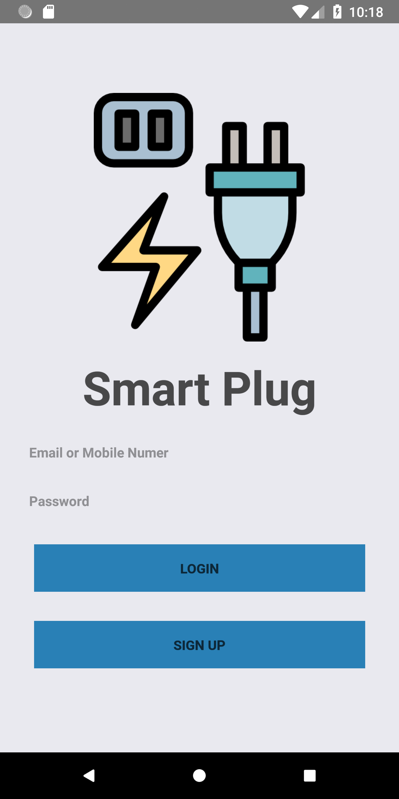
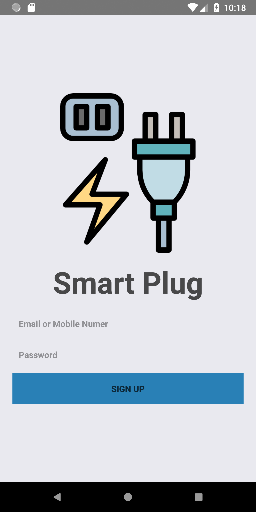
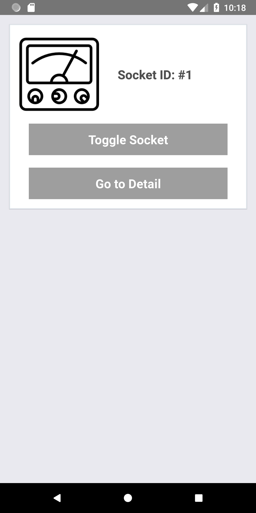
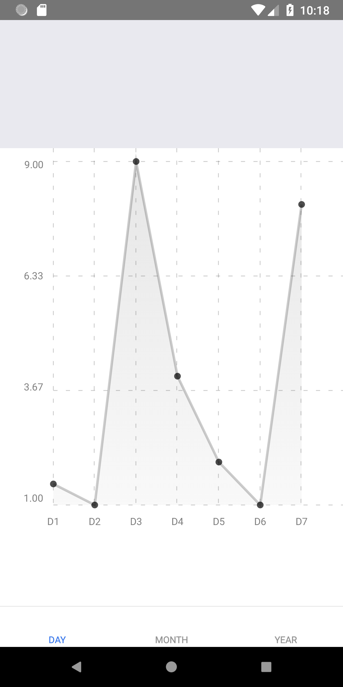

# Install at local
## Make sure you have already installed React Native globally by running this command:

`sudo npm install -g react-native-cli`

## Open Terminal, then type command to clone this repo:  

`git clone https://github.com/arcanine525/IOT-SmartPlug-Demo` 

## Go to project folder and install all libary:

`npm install `

## Run and at Android Simulator:

`react-native run-android`

## Project structure:

See `Project-Structure.md` for more details. It also provides some intructions to help you maintain this app

## Generate APK file: 
* Copy this file into `android/app`
* Go to project folder and run this command:

    `npm run gen-apk`
* The generated APK can be found under `android/app/build/outputs/apk/app-release.apk`

# Basic features

## Login - Sign up

  
  

## Toggle the socket

  

## Statistic chart

  

